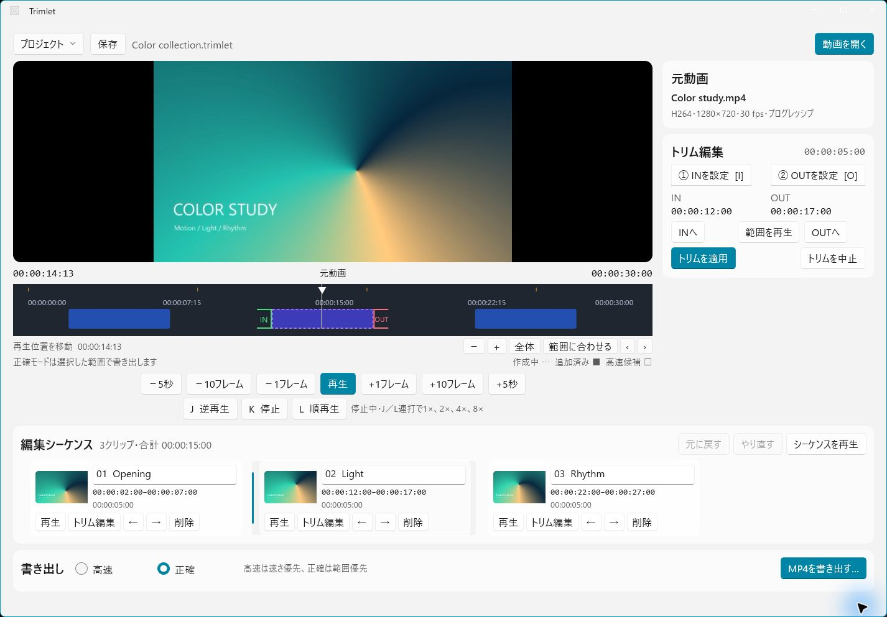

# Trimlet

日本語 · [English](README.md)

**動画の必要なところを切り出し、並べて、1本のMP4に。**

Trimletは、動画の切り出しに絞ったデスクトップアプリです。1本の動画から複数の区間を選び、順番を整えて書き出せます。元の動画は変更しません。編集内容を保存して、後から続けることもできます。

*Windows版の画面です。Mac版は画面構成が異なります。*

## ダウンロードして使う

**[Windows版をダウンロード（x64 ZIP）](https://github.com/jydie5/Trimlet/releases/download/v0.4.0-beta.2/Trimlet-0.4.0-beta.2-win-x64.zip)** · [はじめて使う方へ](docs/user-guide.ja.md)

現在のWindows版は **0.4.0 Beta 2（試験公開版）** です。.NETは同梱しています。初回に **「動画ツール → 同意して準備する」** を押すと、動画処理に必要なファイルを自動で取得します。コマンドや手動のファイル配置は不要です。初回のネット接続と表示される配布元の条件への同意が必要です。署名はなく、クリーン環境での検証は未完了です。

**Mac版は、ダウンロードしてすぐ使えるアプリをまだ配布していません。** 自分でビルドする方向けにソースを公開しています。[開発手順はこちら](DEVELOPING.ja.md)。GitHubの「Source code」は、起動できるアプリではありません。

## できること

- 1本の動画から複数の区間を切り出し、順番を変更する
- 切り出した区間を確認し、1本のMP4に書き出す
- 速さ重視の「高速」と、切る位置を重視する「正確」を選ぶ
- プロジェクトを保存して、編集を再開する

動画を開く → 開始と終了を決める → クリップを追加 → 必要なだけ繰り返して並べる → 書き出す。

MP4・MOV・M2TS・MTSなどを扱います。実際に扱えるかは、ファイル内部の映像・音声形式にもよります。動画処理は自分のパソコン内で行い、Trimletへのアカウント登録や動画のアップロードは不要です。

## 自分用に改造する

欲しい機能がある方は、フォークして自由に変更できます。AIコーディングツールを使った開発も想定しています。

**[開発・改造を始める](DEVELOPING.ja.md)** — コードの場所、起動手順、設計の前提、テスト、AIへの依頼例をまとめています。

自分だけで使う変更にプルリクエストは不要です。本家にも提案したい場合は[貢献ガイド](CONTRIBUTING.md)へ。ソースは[MITライセンス](LICENSE)で公開しており、再配布時はライセンス表記を残してください。

## 困ったとき・応援したいとき

[不具合を報告する](https://github.com/jydie5/Trimlet/issues/new?template=bug_report.yml) · [機能をリクエストする](https://github.com/jydie5/Trimlet/issues/new?template=feature_request.yml) · [更新履歴](https://github.com/jydie5/Trimlet/releases)

コードの知識は不要です。日本語で、やりたかったことと実際に起きたことを書いてください。個人の動画や個人情報は公開しないでください。

[開発を応援する（任意）](DONATIONS.md) · [第三者ライセンス](THIRD_PARTY_NOTICES.md) · [資料一覧](docs/README.md)
