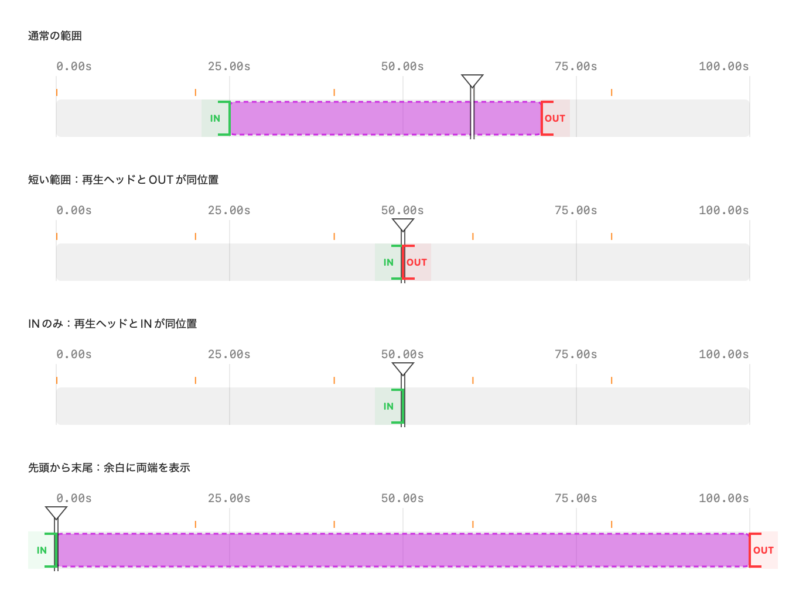
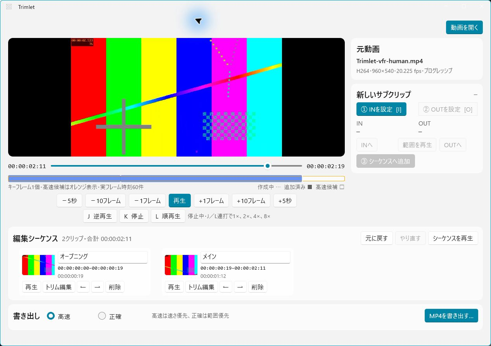

# Trimlet

[English](README.md) | [日本語](README.ja.md)

Only what you need, quickly and precisely.

Trimlet is a lightweight, frame-accurate video trimming application with separate native implementations for macOS and Windows.

## The editing workspace


_Screenshot of the running Windows development app with original, procedurally generated demo footage. It shows the whole editing workflow; no third-party video is included. [Demo recipe](scripts/create-windows-demo.ps1)._

Open a video, collect the moments you want, arrange the clips, save your project, and export one MP4. Current Windows source adds portable `.trimlet` Open/Save/Save As, source relinking, unsaved-change prompts, and the revised timeline with independent outward IN/OUT grips. Use the ruler or range body to seek; zoom, pan, and fit never change the saved ranges.

[Windows changes and verification](apps/windows/BUILD10_PARITY_RETURN.md) · [Run Windows](apps/windows/README.md) · [Human check](apps/windows/HUMAN_CHECK.md)

## Latest macOS UI/UX — 0.4 development build 10

Find a frame, mark IN and OUT, then add the range to your editing sequence—without needing to start playback.

<details>
<summary>Mac timeline component renders (interaction details)</summary>



_Rendered from production UI components using synthetic positions, not a whole-app screenshot. [Dark appearance](docs/images/timeline-build10-dark.png)._

</details>

- **Clear workspace:** viewer and transport on the left, IN/OUT and clip details on the right, editing sequence below; Save and Export at the top.
- **Separate playhead and range:** scrub using the upper ruler or range body. Outward IN/OUT grips adjust only their respective boundary, even for a very short range.
- **Visible controls:** I/O marking, J/K/L shuttle, frame/5-second navigation, two-finger seeking, zoom and Fit Range, plus target/time feedback.
- **Resume your work:** save retained clips and export settings to a `.trimlet` project; reopen and relink moved source media. Uncommitted IN/OUT drafts are not saved.
- **Compatibility previews:** sources the Mac player cannot play, including the tested VP9/Opus MP4, can use a generated H.264/AAC preview. The original remains unchanged; use Accurate output for H.264/AAC compatibility because Fast retains the original video codec.

Build 10 is the latest development source, **not a newly published binary release**. Builds, Core/contract/export tests and component rendering checks passed. Comprehensive live gesture/human acceptance remains pending. Mac boundary snapping uses nominal fps, not a VFR frame index.

[Interaction specification](docs/TIMELINE_INTERACTION_2026-09-09.md) · [Verification](docs/VERIFICATION.md) · [Human check](docs/HUMAN_CHECK.md) · [Windows handover](apps/windows/TIMELINE_INTERACTION_HANDOVER.md) · [Playback limitations](docs/PLAYBACK_COMPATIBILITY_2026-09-09.md)

<details>
<summary>Windows Early Access screenshot (earlier accepted UI)</summary>



Historical screenshot of the previously accepted multi-range workflow. The current Windows workspace is shown above.

</details>

## Product goal

Trimlet opens large video files without loading the whole file into memory, lets the user collect and order multiple IN/OUT ranges, and exports one combined MP4.

It intentionally focuses on one workflow:

1. Open or drop a video.
2. Find the desired range quickly.
3. Mark, add, and reorder retained IN/OUT ranges.
4. Continuously preview the sequence and choose an audio stream.
5. Export one combined file in Fast or Accurate mode.

Priority inputs are MP4, MOV, M2TS, and MTS.

## Editing features

- Create multiple subclips from one source, reorder them in an editing sequence, and export one combined MP4.
- Distinguish the active IN/OUT draft in purple, retained clips in blue, the IN point in green, and the OUT point in red.
- Show a representative thumbnail, editable clip name, and IN–OUT time range for every retained clip.
- Move by one frame with Left/Right, ten frames with Shift+Left/Right, or five seconds with Option+Left/Right.
- Shuttle with `J` for reverse, `K` for stop, and `L` for forward; repeated `J` or `L` presses select 1x, 2x, 4x, or 8x.
- Set IN with `I` and OUT with `O`. These shortcuts are shown on their corresponding controls, and keyboard use remains optional.
- Scrub continuously with the slider or trackpad, followed by an exact seek when the gesture ends.
- Use Fast mode to avoid video re-encoding where possible, or Accurate mode to prioritize exact boundaries with hardware-assisted VideoToolbox encoding.
- Select among multiple audio streams, continuously preview the sequence, monitor or cancel export, and validate the completed output.
- On both platforms' current development source, save the ordered edit list as a portable `.trimlet` project, resume it later, and relink a moved or changed source explicitly.

## Repository status

- macOS: published native `v0.3.0-beta.1`; the current 0.4 build 10 development candidate adds atomic project Save/Open, an unsaved indicator, source relinking, and the revised source-timeline interaction for human check.
- Windows: source-only Early Access; current development source adds project persistence and the build 10 timeline semantics to the accepted multi-range workflow. Developer UI checks cover paused marking, independent grips, zoom, project save/resume, and unsaved-close confirmation. New human acceptance remains pending.
- Parity: shared project version 1 and the revised interaction semantics are implemented on both platforms. Windows retains source-presentation-timestamp navigation. Packaging and broad real-media release validation remain platform-specific work; this source update is not a new binary release.
- Public source releases are published under the MIT License.

Latest macOS Beta source release: [v0.3.0-beta.1](https://github.com/jydie5/Trimlet/releases/tag/v0.3.0-beta.1)

Windows Early Access: [v0.3.0-early-access.1](https://github.com/jydie5/Trimlet/releases/tag/v0.3.0-early-access.1) (source only; no installer or prebuilt executable)

This repository does **not** contain or redistribute FFmpeg, ffprobe, sample videos, or generated application bundles. The current PoC uses a separately installed FFmpeg executable.

## Repository layout

```text
apps/macos/       SwiftUI and AVFoundation implementation
apps/windows/     Windows implementation workspace
contracts/        Platform-neutral data and behavior contracts
docs/             Product, architecture, test, and legal records
scripts/          Local build and validation helpers
.github/          Platform-specific CI and contribution templates
```

The native UI and playback layers are intentionally not shared. Product terminology, timestamp rules, export modes, error categories, fixtures, and acceptance behavior are shared.

See [Repository structure](docs/architecture/REPOSITORY_STRUCTURE.md) and the [platform contract](docs/PLATFORM_CONTRACT.md).

## Try the macOS Beta

Prerequisites:

- Apple silicon Mac
- Swift toolchain compatible with Swift tools 6.1
- Separately installed `ffmpeg` and `ffprobe` in `/opt/homebrew/bin` or `/usr/local/bin`

Double-click `run-poc.command` to build an ad-hoc local application at `dist/Trimlet.app` and open it. Nothing is installed globally or uploaded.

Core checks can be run with:

```bash
swift run --package-path apps/macos TrimletCoreChecks
swift run --package-path apps/macos TrimletIntegrationChecks
```

Generated media and `dist/` are local-only and ignored by Git.

## Try Windows Early Access

Prerequisites:

- Windows 10 build 17763 or later
- .NET SDK 10.0.400
- Separately installed `ffmpeg` and `ffprobe` on `PATH`, in `TRIMLET_FFMPEG` / `TRIMLET_FFPROBE`, or beside the built app

From PowerShell:

```powershell
git clone https://github.com/jydie5/Trimlet.git
Set-Location .\Trimlet
.\apps\windows\run-human-check.ps1
```

This validates contracts, tests, and synthetic exports before launching the unpackaged developer build. See the [Windows Early Access guide](apps/windows/README.md) and [human-check steps](apps/windows/HUMAN_CHECK.md).

## Support development

Trimlet is free, MIT-licensed software. If it is useful, you may **[voluntarily support continued development on Buy Me a Coffee](https://buymeacoffee.com/jydie5)**.

Support helps with code signing, Windows/macOS hardware validation, build services, and development AI/API costs. It is optional: payment does not unlock features, change the license, or give paying users priority.

You can also help at no cost by starring or sharing the repository, reporting reproducible bugs, testing on different machines, or improving code and documentation. See [Supporting Trimlet](DONATIONS.md) and [how project reach and support are measured](docs/development/project-sustainability.md). Trust only funding links published in this repository.

## Documentation

- [Product requirements](docs/REQUIREMENTS.md)
- [Technical decisions](docs/DECISIONS.md)
- [Open questions](docs/OPEN_QUESTIONS.md)
- [Mac/Windows platform contract](docs/PLATFORM_CONTRACT.md)
- [Project persistence architecture](docs/architecture/PROJECT_PERSISTENCE.md)
- [Product and interface design principles](docs/PRODUCT_DESIGN.md)
- [Windows Early Access guide](apps/windows/README.md)
- [Windows maintainer handover](apps/windows/handover.md)
- [Windows project-persistence handover](apps/windows/PROJECT_PERSISTENCE_HANDOVER.md)
- [Windows-to-macOS owner handover](apps/macos/WINDOWS_EARLY_ACCESS_HANDOVER.md)
- [Windows multi-range return handover](apps/macos/WINDOWS_MULTI_RANGE_HANDOVER.md)
- [v0.3.0 Beta 1 release notes](docs/releases/v0.3.0-beta.1.md)
- [Mac PoC scope](docs/POC.md)
- [Human-check guide](docs/HUMAN_CHECK.md)
- [Verified environment](docs/ENVIRONMENT.md)
- [PoC verification record](docs/VERIFICATION.md)
- [Accurate export and FFmpeg plan](docs/ENCODING_PLAN.md)
- [Release compliance checklist](docs/legal/RELEASE_COMPLIANCE.md)
- [Name/trademark search record](docs/legal/TRADEMARK_SEARCH_2026-08-16.md)
- [Project license recommendation](docs/legal/LICENSE_DECISION.md)
- [Project sustainability and reach](docs/development/project-sustainability.md)
- [Development backlog](docs/BACKLOG.md)
- [Build 10 timeline interaction specification](docs/TIMELINE_INTERACTION_2026-09-09.md)

## Privacy and safety

Media processing is local. Trimlet has no account, analytics, telemetry, or upload feature. Source media is treated as read-only, and exports are finalized only after validation.

## License

Trimlet source code and documentation are available under the [MIT License](LICENSE). The copyright notice uses the collective name `Trimlet contributors`; no personal attribution is required beyond preserving the MIT notice in copies or substantial portions.

FFmpeg is a separate project with its own license conditions; see [Third-party notices](THIRD_PARTY_NOTICES.md).
